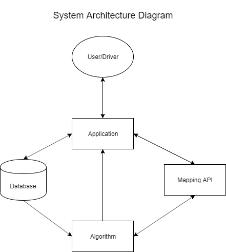
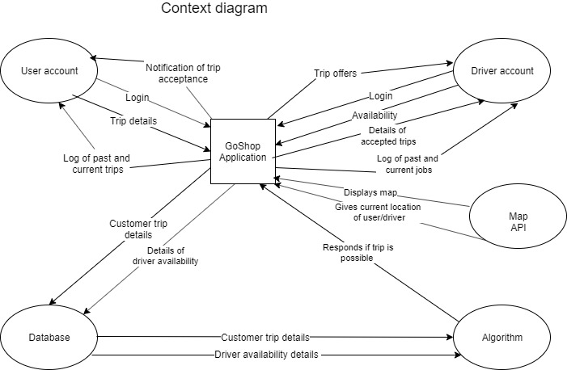
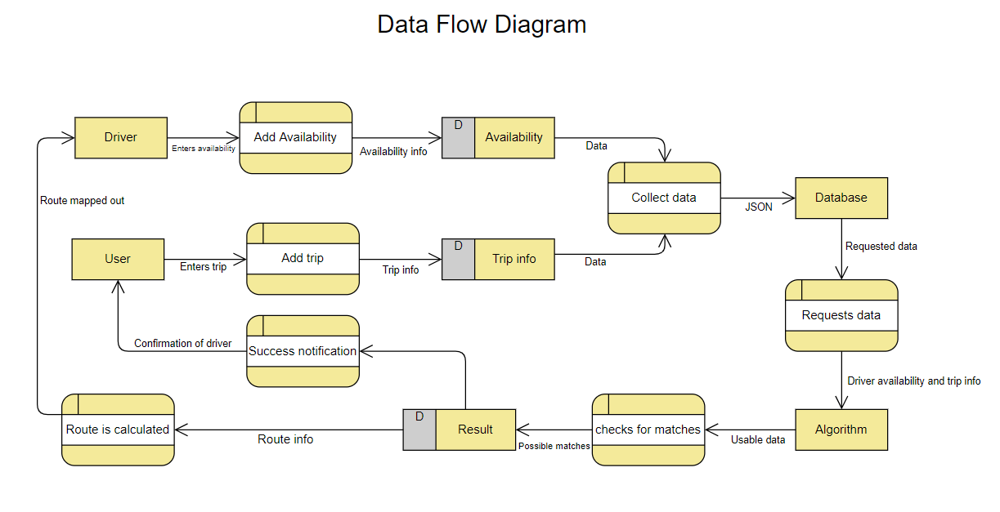
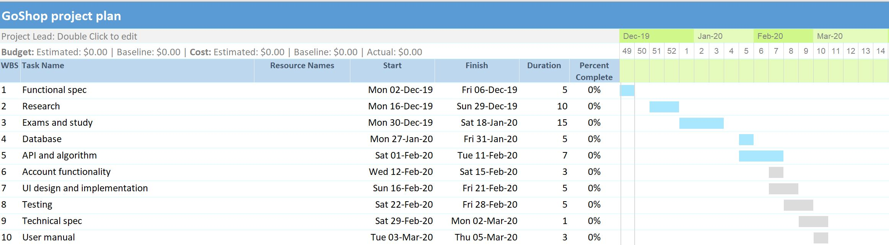

### Section 1: Introduction
------
1.1 Overview  
1.2 Business Context  
1.3 Glossary  
### Section 2: General Description
------
2.1 Product System Functions  
2.2 User Characteristics and Objectives  
2.3 Operational Scenarios  
2.4 Constraints  
### Section 3: Functional Requirements
------
3.1 Database  
3.2 Algorithm  
3.3 User/Driver accounts  
3.4 User/Driver login  
3.5 User adds trip/Driver adds availability  
3.6 Get user location  
3.7 Mapping  
### Section 4: System Architecture
------
4.1 System Architecture Diagram
### Section 5: High-Level Design
------
5.1 Context Diagram  
5.2 Data Flow Diagram
### Section 6: Preliminary Schedule
------
6.1 Software requirements  
6.2 Hardware requirements  
6.3 Gantt chart
### Section 7: Appendix
------
# Section 1: Introduction
------

##### _1.1 Overview_
GoShop is an Android application designed for people who may need assistance with their supermarket shopping. There are two types of accounts, a user account and a driver account. The user account will belong to the person who requires assistance with their shopping. The driver account will belong to the person who assists the person who requires assistance.

The user inputs their trip details which includes their full name, phone number, email address, the date and time they would like to go to their chosen supermarket at along with the location they would like to be collected from. If there is an available driver, that driver will get a notification asking them if they can bring the user to that given supermarket. If they accept, the user will get an alert notifying them that a driver can assist them.

There are two ways a driver can bring someone to the supermarket. The first way is that they input their availability in advance of the day they will be volunteering. The second way is that they decide on the day that they would like to volunteer and can make themselves “available” on the app. They can also have a combination of both where they have some pre-bookings and then in their spare allocated time can make themselves “available” on the app. The driver will be matched with users based on criteria such as how far they are willing to travel and how long they wish to volunteer for.

We are creating this app because we felt that there was no easy way for people who need help with their supermarket shopping to get help. There are many reasons as to why someone may not be able to complete a supermarket shop alone. They may have a physical disability, a chronic illness, a broken bone or are recovering from a surgery and can’t drive. They may also be an elderly person that requires assistance. Our application strives to solve this issue by providing a simple and easy to use service for people to get help with their supermarket shopping.

##### _1.2 Business Context_
We do not plan on monetising our application however monetisation could be easily achieved by adding advertisements within the app or membership fees for users who need help with their shopping.

##### _1.3 Glossary_  
_API_ - An application programming interface (API) is an interface or communication protocol between different parts of a computer program intended to simplify the implementation and maintenance of software.

# Section 2: General Description
---

##### _2.1 Product System Functions_
The main functions of our app are as follows:

* Create user account 
* Create driver account
* Logging in/out
* User adds shopping trip
* Driver adds availability
* Get user location
* Notification of job that fits criteria
* Notification of trip accepted
* Show driver preview of route and trip information
* View past and current trips of the user

##### _2.2 User Characteristics and Objectives_
Our application will have two different kinds of users. A person who wishes to help others with their shopping (the driver) and a person who requires assistance with their supermarket shopping (the user).

The interface of our application will be very familiar to users who have used mapping services such as Google Maps.

We will be catering for people of different technological experience. To do this we plan to have an easy to use interface with simple language and features. We will ensure to use colour schemes that do not exclude anyone with visual impairments.  

From the users perspective the application should allow them to easily add a trip which would include all their relevant information. They should be able to receive a notification when their trip has been accepted by a driver and then be collected and brought to the supermarket provided with assistance.

From the driver’s perspective, the application should allow them to easily add their availability. They should receive notifications of trips that match their requirements and they should be able to select which trips they would like to complete.

##### _2.3 Operational Scenarios_
_Unregistered user opens app_  
The user will need to create a user account. They will be required to enter their full name, mobile number, email address, username and password in order to create an account. After the account is created they will have access to the same features as the registered user scenario.

_Registered user enters app_  
When the user logs into their account they have the option to view current/past trips and to add a new trip. When they select to add a new trip they will be required to enter the following information for the trip:

* the date they would like to go to the supermarket
* the location of the supermarket
* a preferred time slot
* the duration of time they will need to spend in the supermarket
* whether they require a regular or wheelchair accessible car 
* the location they would like to get collected

They will have the option to manually add a location from the map or use their current location. The user will have the option to pre-book in advance or to book on the day. When they select to view past/current trips they will be able to view a history of all their trips. The user will also have access to a personal profile.

_Unregistered driver opens app_  
The driver will need to create a driver account. They will be required to enter their full name, mobile number, email address, a copy of their driver's license, proof they have been garda vetted and to set a password and a username. After they have created their account they will have access to the same features as the registered driver scenario.

_Registered driver opens app_  
When the driver logs into their account they will have the option to become available to assist others immediately or to set a time and date of availability. This may or may not be recurring e.g. available to assist people every Tuesday from 2-5. The driver will also have access to a personal profile.

##### _2.4 Constraints_
_Time constraints_  
We have a finite set of time and will need to manage it carefully by setting personal deadlines. 

_Financial constraints_  
In order for the app to present a live map, there must be a cost-effective
service. Billing services might cost too much, so we will select the mapping service that best meets our needs on both a financial and functionality level.

# Section 3: Functional Requirements
---

##### 3.1 _The Database_
_Description_  
The database will store the user login details. The username will be stored in plain text, while the password will be hashed. The database will hold the user’s past and current trip information. The database will also hold the details of the driver’s availability.

_Criticality_  
The database is of utmost importance to our application. In order for the algorithm to potentially match a user and driver together, we must ensure this data is stored safely and can be accessed at any time.

_Technical Issues_  
Information must be stored in an efficient and secure manner to ensure privacy for our users.

_Dependencies_  
The database is not dependent on any other requirements.

##### 3.2 _The Algorithm_
_Description_  
The algorithm will look at a multitude of factors in order to try and match a user with a driver.
For the user it will look at:

* The location of the user, 
* Their supermarket of choice 
* The date and what time they want to go 
* How long they will spend in the supermarket.

For the driver it will look at:
* The location of the driver
* The date and time they are available
* How far they’re willing to travel

_Criticality_  
This requirement is of utmost importance to the system. Without it, no users would be matched with drivers and vice versa.

_Technical Issues_  
We must ensure that we are mindful of the complexity of our algorithm.

_Dependencies_  
The algorithm is dependant on the database as it stores all of the required information to create a match. It is also dependent on the Mapping requirement as it uses the Mapping API to see if a match has been created.

##### 3.3 _User/Driver Accounts_
_Description_  
The person who requires assistance with their shopping will use the user account. The person who wishes to help people with their shopping will use the driver account.

_Criticality_  
This is a critical functional requirement as without it the person won’t be able to access any of the features of our app.

_Technical Issues_  
Personal information is very sensitive. For this reason we will be taking extra measures to ensure the safety of our customer’s data. We will store the login details securely and ensure that passwords are hashed. The user/driver needs to select a username that does not already exist in order for their details to be unique to them.

_Dependencies_  
This function is dependent on the database as this is where the users/driver’s details are stored.

##### 3.4 _User/Driver Login_
_Description_  
The user/driver will enter their registered username and password in order to gain access to their account. 

_Criticality_  
The login feature is essential in order for the user to gain access to their account and to enable them to use the features of the app.

_Technical Issues_  
The hashing of passwords will ensure accounts are secure and those without authorised access will not be able to access them.

_Dependencies_  
This function is dependent on the create user/driver account function as the user must have registered in order to log in.

##### 3.5 _User adds trip/Driver adds availability_
_Description_  
The user adds details of their trip and creates a new trip. The driver will add their availability. The driver will be given a list of trips that fits their criteria and can choose which one they would like to do.

_Criticality_  
This is critical to the system as the algorithm needs these details to match drivers and users.

_Technical Issues_  
Provided that our database is set up correctly, we do not expect to experience any technical issues.

_Dependencies_  
This is dependent on the database as this is where all the information will be stored.

##### 3.6 _Getting user location_
_Description_  
The app will have the ability to get the current user’s location using the map API. When the user adds a trip, they may use their current location as their pickup point. When a driver accepts a job, the application will use their current location to show them the route they will take to pick up the user.

_Criticality_  
Knowing the driver’s current location is very important in order to calculate the route. The user’s location is important but they have the option to also add in manually.

_Technical Issues_  
In order to use the current location feature users will have to allow location services within our app.

_Dependencies_  
This requirement is dependent on the mapping requirement, as the mapping API gives the current location.

##### 3.7 _Mapping_
_Description_  
The mapping requirement will allow the driver to see what route they will take to the users’ house and their chosen supermarket. It will also be used to see what trips will be suggested to drivers based on their availability and other constraints inputted by the driver.

_Criticality_  
The mapping function is of utmost importance because the algorithm has the following functions:

* Give the driver directions to:  the users location, from the users location and to the chosen supermarket.
* Give the distance between the driver and the user, along with the distance from the user to the shop.
* Give an estimation of the time it will take to collect the user and how long it will take to get from the users location to the shop.

_Technical Issues_  
The driver doesn’t have current location enabled on their device. It will be essential that we have our algorithm and mapping API running concurrently.

_Dependencies_  
The mapping requirement is dependent on the algorithm for important information.

# Section 4: System Architecture
___

##### _4.1 System Architecture Diagram_

 
## Fig 4.1

Fig 4.1 above illustrates the architecture of the product. The diagram highlights the five main  
elements of our system architecture:

_User/Driver_  
The user/driver is the person who can access the application after logging in.

_Application_  
This is the Android application installed on the Android device. It will be developed using Android Studio and written in Java. 

_Mapping API_  
The mapping API will display the map on the Android device, it will also be used to access the user/driver’s current location should they use this feature. We will be using it to compute travel times and to display routes to the driver. We have chosen to use Mapbox.

_Database_  
The database will be a Google Firebase Realtime Database. The database will store all account information as well as all trip and driver availability information.

_Algorithm_  
The algorithm will be used to match driver’s with user’s based on the trip details the user has added and the driver’s availability. It will also compute the most efficient route for the driver based on their current schedule.

# Section 5: High-Level Design
---

##### _5.1 Context Diagram_

 

##### _5.2 Data Flow Diagram_

# Section 6: Preliminary Schedule
---

##### _6.1 Software Requirements_
In order to use the Android Emulator we must be running a 64-bit version of Windows.
In order to run our application the phone must be running Android operating system.

##### _6.2 Hardware Requirements_
There are no specific hardware requirements. Any relatively new Android phone will run our application. 

##### _6.3 Gantt Chart_

# Section 7: Appendix
---
Docs.oracle.com. (2019). Java Platform SE 7. [online] Available at: https://docs.oracle.com/javase/7/docs/api/

Android Developers. (2019). Documentation  |  Android Developers. [online] Available at: https://developer.android.com/docs/

Mapbox. (2019). Introduction. [online] Available at: https://docs.mapbox.com/api/

Firebase. (2019). Documentation  |  Firebase. [online] Available at: https://firebase.google.com/docs
