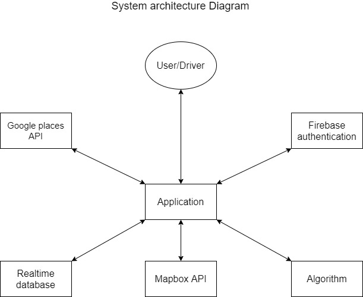
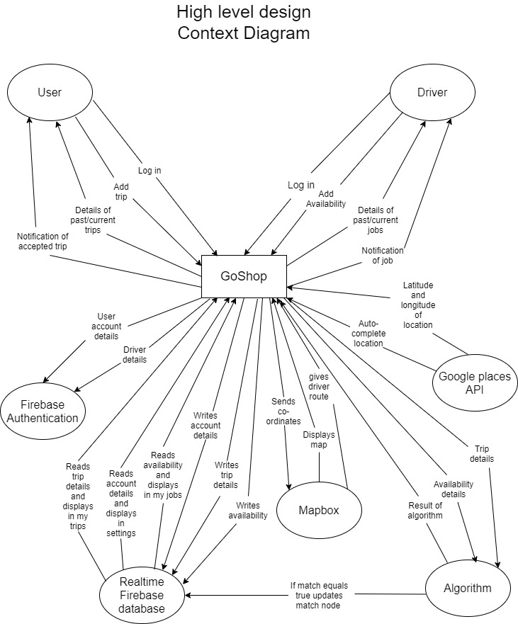

# GoShop 

## Technical specification
### Rachel White and Luke Hebblethwaite  
### Table of contents

#### 1.Introduction
---
1.1 Overview  
1.2 Glossary  

#### 2. System Architecture
---
2.1 System Architecture diagram
2.2 Description of System Architecture

#### 3. High-level design
---
3.1 Context Diagram  
3.2 Use Case Diagram  
3.3 Data Flow Diagram  

#### 4. Problems and resolutions
---
##### 4.1 New software  
4.1.1 Android Studio  
4.1.2 Firebase  
##### 4.2 Fragments  
4.2.1 Changing from side navigation bar to bottom  
4.2.2 Learning how to use fragments  
##### 4.3 Mapbox places API  

#### 5. Installation guide  
---

#### 6. Future developments of the app  
---

#### 7. Links 
---
7.1 Blog  
7.2 Gitlab  
7.3 Testing  

#### 1. Introduction 
___
##### 1.1 Overview

GoShop is an Android application designed to help those who require assistance with their supermarket shopping. They may require assistance due to a disability, a chronic illness, a broken bone or due to being elderly. We felt there was a gap in the market for this type of service as people lead very busy lives, so family and friends who work 9-5pm everyday may not be available to assist when needed. 

It is a volunteer based app. There are two types of accounts; a driver and a user. Those who wish to volunteer sign up as a driver. They can then add their availability by providing their start point, chosen date and time, the type of car they have (regular/wheelchair accessible) and the distance willing to travel. This gives the volunteer flexibility and enables them to fit it into their schedule. Those who would like to avail of the service sign up as a user. Once they have registered they can then add a trip by providing their chosen pickup point, date, time, supermarket of choice and whether they require a regular or wheelchair accessible car.

The app works by matching suitable trips with a driver's availability based on their given criteria, to create the best match. Both the driver and the user will be notified when a match has been made. The driver will be provided with a map of the route to follow within the app. The user will be collected at their given pickup point on their given date and time. The driver will bring them to their chosen supermarket, help them with their shopping and drop them home. 

##### 1.2 Glossary
___
___API - Application Programming Interface___
An API is an interface/communication protocol between various parts of a computer program. The purpose of an API is to make the implementation and maintenance of software easier. Examples where an API may be used include computer hardware, operating systems, database system and software library. 

___Google Places API___
Google Places API is similiar to a search bar. When a place name is entered it returns suggestions based on your search.

___Firebase Authentication___
Is used to authenticate users when they log into the app. It checks that the email and password provided by the user match the email and password stored in the database.

___Firebase Realtime Database___
This is a cloud-hosted database. This is a NoSQL database with the data stored as a JSON file. It runs in real time which means updates are made as soon as data is added. 

___NoSQL database___
A NoSQL database is a type of database where the data is stored in non-tabular form unlike a SQL database. 

___JSON___
This is a format used for transmitting data over a network connection.

__Activity__
An activity is a representation of an individual screen with a user interface.

__Fragments__
A Fragment is similiar to an activity in Android Studio. It is a combination of an XML file which describes the layout and a Java class.

#### 2. System Architecture
____
##### 2.1 System Srchitecture Diagram

##### 2.Description of System Architecture
The user/driver interacts with the application. All other components interact directly with the application. 

* Firebase Authentication
When the user/driver signs in with their registered email and password the application interacts with Firebase Authentication in order to verify the details given. If the email and password match the database the user/driver will be logged into the app. If the details given are incorrect an error message will show and prompt the user to re-enter their details correctly.

* Firebase Realtime Database
When the user/driver enters their trip/availability in the app the details of their trip/availability will be added to the Realtime Database. The application also reads from the Realtime Database to display the users/drivers account details which are displayed on the settings page. Similarly the application reads from the Realtime Database to display the users/drivers trips/jobs in the my trips/my jobs page in the application.

* Algorithm 
The algorithm gets the trip and availability information from the application which has read this information from the Realtime Database. It then compares the trip/availability information and returns whether or not they are a match.

* Mapbox API
The Mapbox API receives the co-ordinates of place names from the app which has read these details from the Realtime Database. It then calculates a route for the driver and gives them directions to the user's pickup point and user's chosen shop.

* Google Places API
When a user/driver is entering a trip/availability in the application, when entering a place name the app interacts with Google Places API in order to offer a listing of places that match their search.

#### 3. High-level design
____
##### 3.1 Context diagram

##### 3.2 Use case diagrams

##### 3.3 Data Flow diagram

#### 4. Problems and resolutions
____
##### 4.1 New software
###### 4.1.1 Android Studio
When starting the project neither of us had used Android Studio, this was very new to us. The solution to this problem was to become more confident with the software. In order to do this, we had to spend a considerable amount of time researching online to find resources and tutorials to broaden our knowledge. It took us a while to get going with the project due to this constraint but once we were familiar with Android Studio we were able to progress at a much faster rate. Thankfully we began the project early so we could afford to spend some time on this.

###### 4.1.2 Firebase Realtime Database
We had never used a NoSQL database before, this brought its own problems. The solution to this was to set aside time to learn the fundamentals of a NoSQL database in order to understand how it operated. From there we could design how we wanted our database to look and write to it in a specific way so that it looked how we wanted it too. This took more time than expected. We struggled to read from the database and to display it in the app in a specific fragment. This was due to our lack of knowledge of a NoSQL database. By researching and expanding our knowledge we were successfully able to accomplish this.

##### 4.2 Fragments
###### 4.2.1 Changing from side navigation bar to bottom navigation bar
When designing the app we knew we would need a navigation bar in order to view the various pages. We assumed choosing an activity with a built-in side bar was the answer to our problem, which it definitely was not. The side navigation bar was not suitable for our app at all. It was overly complicated and took up two thirds of the page when opened. It had many functions that were completely unnecessary for our app. Given one of our target audiences is the elderly we wanted to create an easy to use interface so the solution was to change to a bottom navigation bar. As we had chosen an activity that had a side navigation bar integrated into it we had to spend time removing this code we no longer needed. When choosing a bottom navigation bar we were unaware that we needed to use fragments instead of activities.

###### 4.2.2 Learning how to use fragments
We had to overhaul our code completely to change from activites to fragments. Thankfully as we were in the early stages of development this didn’t affect the project significantly. Using fragments instead of activities took a lot more time and effort as they are more complex. Given fragments are relatively new there was much less resources online for every component of our app such as designing the UI and displaying information from our database. The solution to this was to really educate ourselves on the fundamentals of fragments to be able to fully understand how they operate. Having gained a good understanding of fragments we could then adapt our code to work with them. 

##### 4.3 Mapbox Search API
For the add trip/add availability form we needed to include auto-completion for when a location was being entered ie: user pickup point, destination and driver start point. Originally we had planned to use Mapbox to do this but when we began researching it we found very limited resources online. The solution to this problem was to use google places API. Having carried out research on similiar API's we decided Google Places API was better suited to our needs as it contained a lot more Irish place names than Mapbox did. 

#### 5. Installation guide
You need Android Lollipop or above to use our app. We chose to use an APK download.

1. Go to the following link. (https://gitlab.computing.dcu.ie/hebblel2/2020-ca326-lhebblethwaite-goshop/tree/master/app_apk)

2. The APK can be found in this directory or alternatively you can use [this link](http://www.mediafire.com/file/60lxvn6ipyit22r/GoShop.apk/file) to bring you to a Mediafire page.
 
3. Press download icon.

4. Press download.

5. Open downloaded file.

Alternatively you can locate this in your notifications section.

6. Press install.

7. You will get a notification to show it has been installed.

#### 6. Future developments of the app
___
We intentionally designed our code so that it had flexibility and could be easily adapted for different uses. Our app could be adapted to be used in a different scenarios. Focusing on our current target audience it could be used to bring these users anywhere they may need to go. Examples of this could the pharmacy, to the dry cleaners, to the barbers/hairdressers, to the shops, the list is endless.

Another adaptation idea we had was to change it into a carpooling app. This would require a very small adjustment to our code. We would need to add in more waypoints into our routing system and to adapt our algorithm. 

#### 7. Links
____
Our blog can be found [here](https://rachelwhite75.wixsite.com/goshop)

Our gitlab can be found [here](https://gitlab.computing.dcu.ie/hebblel2/2020-ca326-lhebblethwaite-goshop)

Our testing can be found [here](https://gitlab.computing.dcu.ie/hebblel2/2020-ca326-lhebblethwaite-goshop/tree/master/testing)

Our APK can be downloaded [here](http://www.mediafire.com/file/60lxvn6ipyit22r/GoShop.apk/file) 

