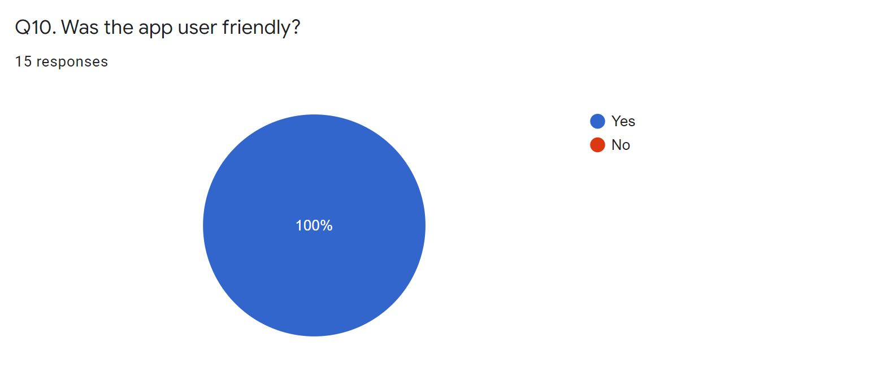
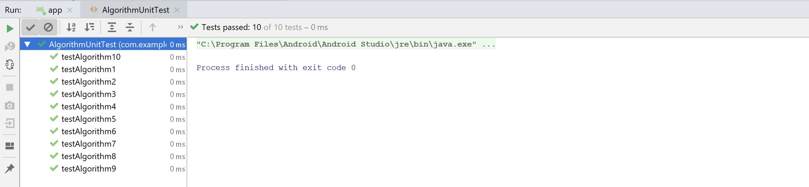

## GoShop 

### Technical specification
#### Rachel White and Luke Hebblethwaite  

#### Table of contents

#### 1. User testing
---
#### 2. UI testing
---
2.1 Walkthrough and user testing  
2.2 Espresso  
2.3 Unit testing  
#### 3. Unit testing
---
#### 4. Database testing
---

### 1. User Testing 
___
We choose to carry out user testing in order to receive live feedback on our app. While software testing is very important we felt it was as important to get feedback from potential users. Given our app has two types of users we asked each person involved in the testing to test the app as both a user and a driver so we could get feedback on both user interfaces. We designed our questionaire to cover questions on both interfaces. 

We chose to ask 10 questions in order to be able to fully evaluate the persons experience with the app and to assess each of the features. Below are the questions asked, along with the results represented in graph form.

We got good feedback from carrying out user testing. Overall the users who carried out the testing said that our user interface was well laid out and easy to follow. They found it easy to navigate through our app. Some said they liked the notification system and the search bar feature for place names. A suggestion we got was to make my trips/jobs section more aesthetically pleasing which we both agree with and if we had more time we would improve the look of this page. 

### 2. User Interface Testing
___
#### 2.1 Walkthrough and user testing
___

In order to test our user interface we did a few different forms of testing. We did walkthroughs of the app ourself in order to test the functionality of our app. This included testing that the login function worked successfully and displayed the correct message for a successful login and for an unsucessful login. We also checked that our buttons functioned as we expected them too. This included that they had the correct labels, clicked when pressed and lead to the correct fragment. We also had to ensure that the add trip/add availability buttons wrote to the database when pressed. We assessed the navigation bar to ensure it navigated to the correct fragments and that we had labelled the fragments corresponding to the navigation bar correctly. We ensured that both the my trips/jobs and settings pages in the user and driver interface displayed the correct information from our realtime database. The user testing we carried out further confirmed that our user interface was working correctly as it was tested many times. 

#### 2.2 Espresso UI testing 
___ 
We choose to carry out espresso testing on our application in order to further verify that our app functions as it should. We ran this testing for the user and driver interfaces. For the user/driver this involved logging in, the use of the navigation bar and adding a trip/availability. 

##### Login system
The following screenshots show the testing of our login system. It shows the details entered and that the login button worked correctly. This also demonstrates that the authentication of the user/driver works efficiently???

##### Navigation bar
Next we tested the navigation bar to ensure that it was functioning correctly and was redirecting the user/driver to the correct corresponding fragment to the symbol given in the navigation bar. An example of this testing for My trips and settings can be seen below.

##### Add Availability/Trip
Lastly we tested the Add Availability/Trip forms. The below screen shot shows an example of some of the text entered and we also checked the functionality of the button, in this case "Add Availability". 

### 3. JUnit Testing
___

We chose to carry out unit testing on our algorithm given this is a major part of the functionality of our app. Below is the code we constructed for our algorithm.

We decided to test each of our if statements. In order to do this we ran a variety of tests with lots of different values. We began with defining tests to test when the algorithm would be true. 

For the algorithm to be true, all of the following must be true:
* Driver date equals user date
* Driver start time is less than or equal to user start time
* Driver end time is greater than or equal to user end time
* Driver car type is equal to the car type required by the user
* The total distance of the user's trip is less than the distance the driver is willing to travel

Given that every if statement has to be true, we felt two tests was sufficient as this would test a regular car and wheelchair car. These two tests are shown below. 

There is alot more combinations to test where the match could be false. We carried out eight assertFalse tests:

1. Date is a match, everything else is not
2. Date and start time are a match, everything else is not
3. Date, start time and end time are a match, everything else is not
4. Date start time, end time and car type are a match, total distance is not less than travel distance
5. Date is not a match, everything else is 
6. Date and start time are not a match, everything else is 
7. Date, start time and end time are not a match, everything else is 
8. Date, start time, end time and car type are not a match, total distance is less than travel distance 

An example of number 7 and 8 is shown below.

All of our 10 tests passed as shown below. 

### 4. Database Testing
__
In order to test the rules of our database we used the built in simulator in Firebase. We tested users to see if they would have access to the database. The results are below.
Test 1:

Result 1:

Test 2:

Result 2:

