# GoShop 

## User Manual
### Rachel White and Luke Hebblethwaite  
### Table of contents

#### 1.1 Type of account - Driver
---
1. Sign in
2. Driver Homepage
3. Add availability
4. Jobs
5. Carrying out the job
6. Settings
#### 1.2 Type of account - User
---
1. Sign in 
2. User Homepage 
3. Add Trip
4. My Trips 
5. Settings  
#### 1.1 Type of account Driver
##### 1. Sign in 
Sign into your account using your registered email and password. 

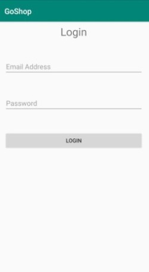

If your details are correct a message will appear saying "login successful".

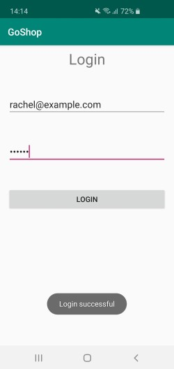

##### 2. Homepage
The homepage gives a brief overview of the app. We have created a guide to explain each symbol in our navigation bar, for ease of use.

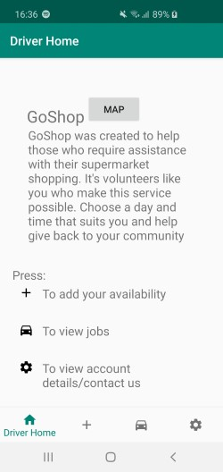

##### 3. Add availability
To add your availability press the + button. This will direct you to a form. You will be required to enter your start point, the date you are available on, the time frame you will be available, the type of car you have (regular/wheelchair) and the distance you are willing to travel. This enables us to make the best match with a user. Having completed the form, click “add availability”. If there is a trip that matches your availability you will get a notification. If there is no current match a message will appear on screen saying "no current match".

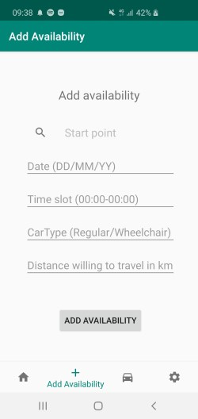

##### 4. Jobs
This page displays a history of your current jobs.

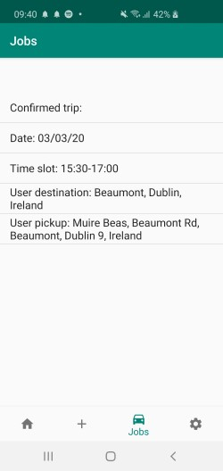

##### 5. Carrying out the job
On the driver homepage there is a map button (as displayed above in driver homepage). To start the job click on the map button. You will then be redirected to the page shown below, which shows the route you will be taking.

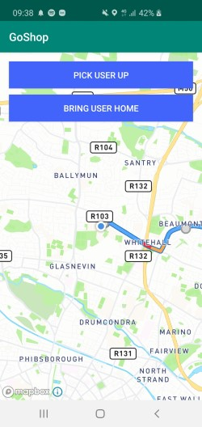

Then to begin the navigation click on "Pick user up" which will give you the route to the users pick up point and then onto their chosen shop. When finished in the supermarket click "bring user home" to get the route from the supermarket back to the user's pickup point.

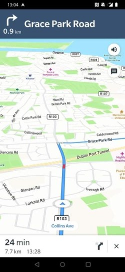

##### 6. Settings 
This page gives details including your registered name, email and phone number. We also included an email address should you need to contact us with any questions.

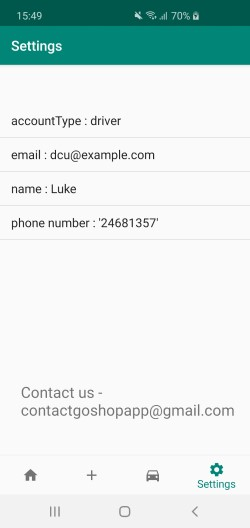

#### Type of account - User
##### 1. Sign in 
Sign into your account using your registered email and password.

If your details are correct a message will show saying login successful.

##### 2.Homepage 
The homepage gives a brief overview of the app. We have created a guide to explain each symbol in our navigation bar, for ease of use. 

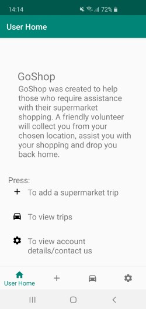

##### 3.Add Trip
To add a shopping trip press the + button. You will be required to enter a pickup point, your chosen supermarket, the time frame you would like the trip to take place in, the date you would like to go and the type of car you require (regular/wheelchair accessible). Having filled out the form press the “Add Trip” button. If there is a driver available you will get a notification. If there is no match at the time of adding your trip a message will appear on the screen saying "no current match".

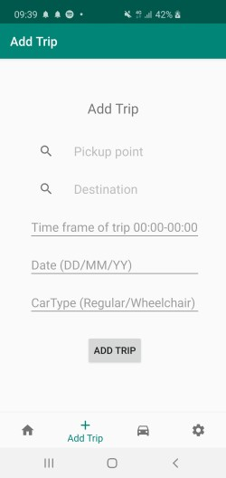

###### 4.My Trips
This page displays a history of your past, current and upcoming trips. 

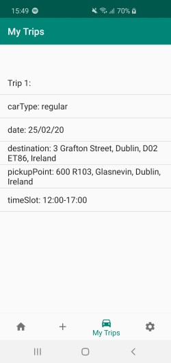

###### 5.Settings
This page gives details including your registered email and phone number. We also included an email address should you need to contact us with any questions.

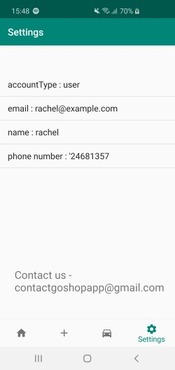

